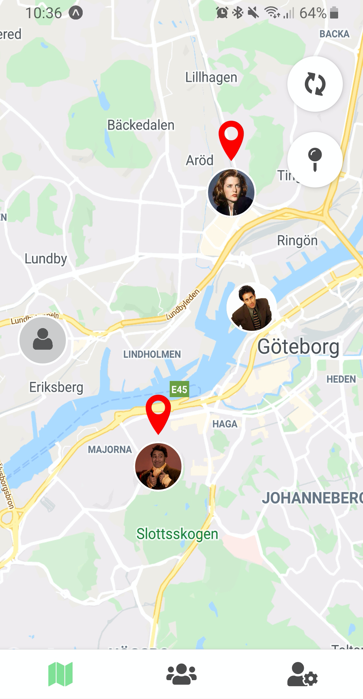
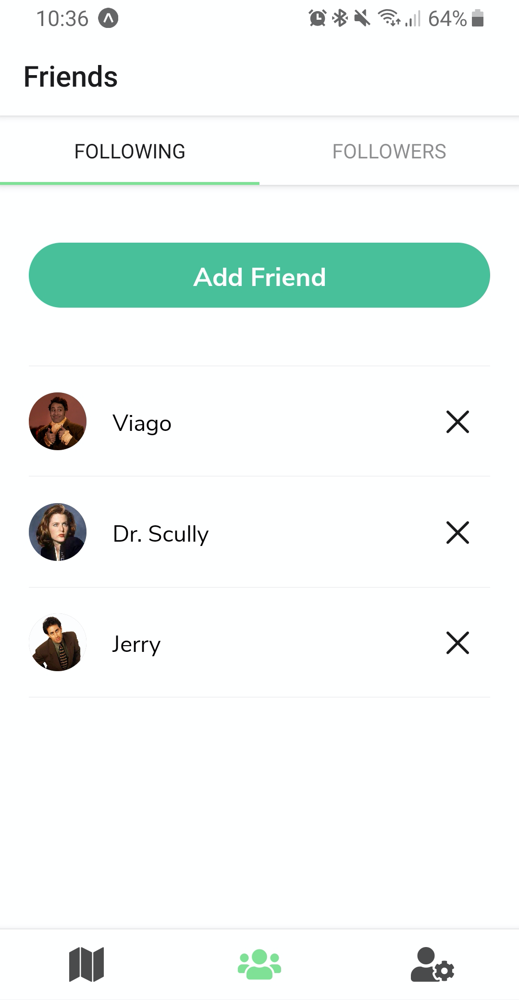

# GeoFriends



>School project where the assigment was to develop a new website for Gundla Gårdscafé and their business. The customer wanted a simplistic design with an easy way of editing the content on the website without coding. For editing the content we chose [Sanity](https://www.sanity.io/), a headless CMS with an easy and customizable user interface. The website is live at this [link](https://gundlagards-cafe.vercel.app/).

## Installation

1. Clone the repository

```
$ git clone https://github.com/Ljungblad/geofriends
```

2. Install all dependencies

```
$ npm install
```

3. From the root of the project, run `npm start` to start a local server for the app.

```
$ npm start
```

4. Download the [Expo Development Client](https://expo.io/tools#client) for Android or iOS.

5. Scan the QR code with your camera to start the app.

## Built with:
- [React Native](https://reactnative.dev/)
- [Expo](https://expo.io/)
- [Firebase](https://firebase.google.com/)
- [React Native Maps](https://github.com/react-native-maps/react-native-maps)

## Authors
- [Michaela Lundborg](https://github.com/lundborgm)
- [Victor Ljungblad](https://github.com/Ljungblad)
