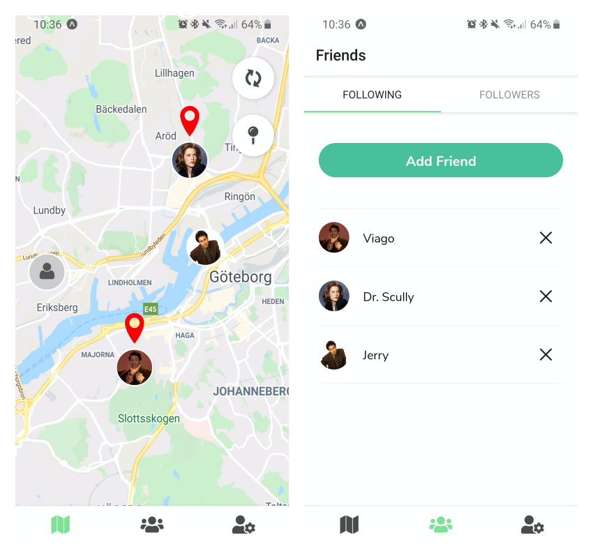

# GeoFriends


>GeoFriends is an app built with [React Native](https://reactnative.dev/) and [Firebase](https://firebase.google.com/) where users can follow their friends and see their location on a map. Each user can also place a pin on the map with a description that is displayed to the users followers. 

## Installation

1. Clone the repository

```
$ git clone https://github.com/Ljungblad/geofriends
```

2. Install all dependencies

```
$ npm install
```

3. From the root of the project, run `npm start` to start a local server for the app.

```
$ npm start
```

4. Download the [Expo Development Client App](https://expo.io/tools#client) for Android or iOS.

5. Scan the QR code with your camera to start the app.

## Built with:
- [React Native](https://reactnative.dev/)
- [Expo](https://expo.io/)
- [Firebase](https://firebase.google.com/)
- [React Native Maps](https://github.com/react-native-maps/react-native-maps)

## Authors
- [Michaela Lundborg](https://github.com/lundborgm)
- [Victor Ljungblad](https://github.com/Ljungblad)

## License
This project is licensed under the MIT License.
